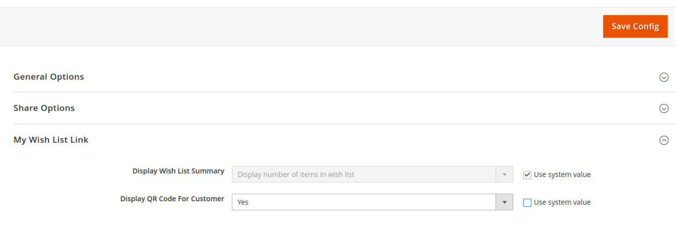
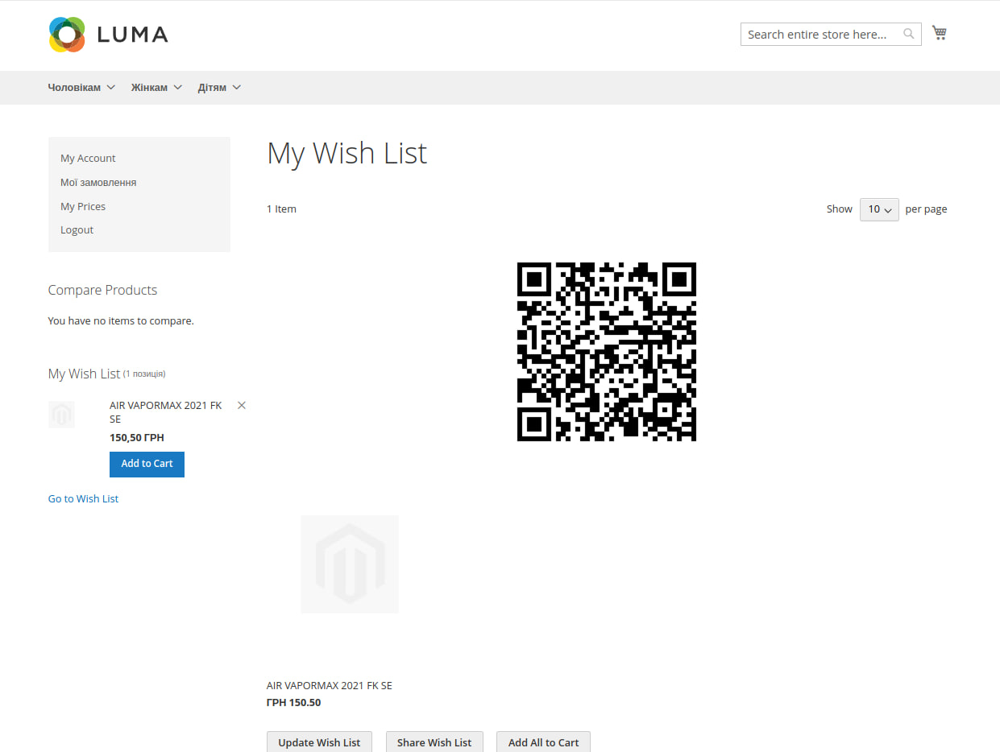

**QR WishList for Magento 2**

**Description:**

The "QR WishList" module offers a simple and convenient way to share your wish list with friends and family on your Magento 2 store. This module adds a QR code to the wish list page in your Magento 2 store. After adding items to the wish list, users can easily obtain a QR code that can be scanned from a mobile device to view or share the wish list.

**Key Features:**

- QR Code Generation for Wish List: Upon visiting the wish list page, the module automatically generates a QR code that can be easily scanned from a mobile device.

- Share with Friends: Users can share the QR code of their wish list with friends or family by scanning, sending, or distributing the code.

- Simple On/Off Switch: The module features a simple management interface that allows users to easily toggle its functionality on or off using a convenient switch.

**Benefits:**
- Convenient way to share wish lists with friends and family.
- Enhances user interaction with your Magento 2 store.
- Increases engagement and usability of your online store.

**Installation:**

To install the module, use the following console command:

`composer require peachcode/wishlistqr:dev-main`

**Additionally**, the following package will be installed along with this module:

`chillerlan/php-qrcode`

After installation, run the following commands:

`php bin/magento setup:upgrade`

`php bin/magento setup:static-content:deploy`

The "QR WishList" module is designed to make the process of sharing your wish list more convenient and efficient for you and your customers.

**How to enable module?**

**Admin->Stores->Configurations->CUSTOMERS->Wish List->My Wish List Link**->Display QR Code For Customer -> **YES**

Result on wish list page:

**Magento 2.4.6**

**Magento 2.4.6.p1-p3**
